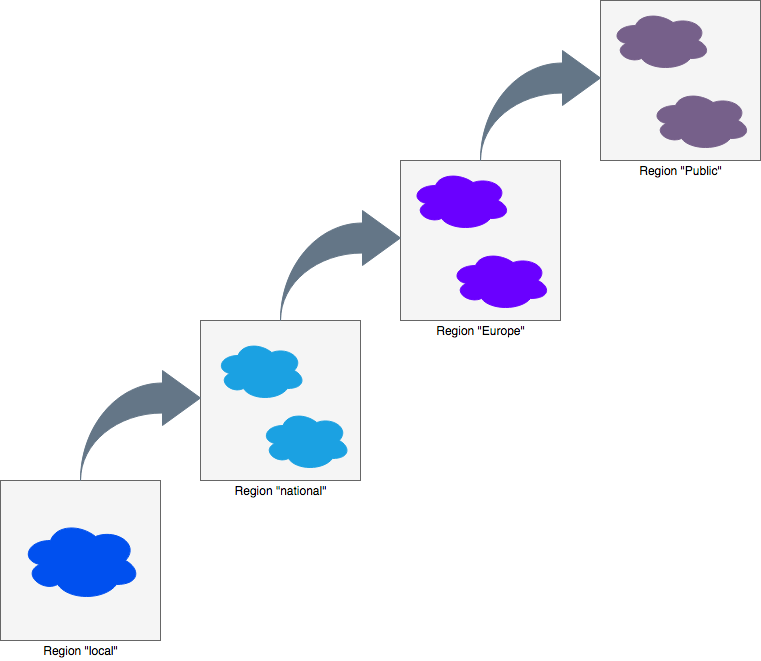

# IMC

## Overview

It is frequently assumed that when you're using a cloud you have access to an essentially infinite amount of resources, however this is not always the case. IMC is for situations when you have access to multiple small clouds and you need a tool which can deploy and configure virtual infrastructure on automatically-selected clouds, and also automatically handle deployment failures.

Features include:
* selection of clouds which meet specified requirements
  * e.g. I want to deploy a CentOS 7 VM with at least 8 cores and 32 GB of RAM
* clouds are ranked based on specified preferences
  * e.g. I would prefer my VMs to be deployed on my local private cloud, but if that is full try my national research cloud, but if that is also full then use a public cloud
* if deployment on a cloud fails, another cloud will be automatically tried, and the cloud which failed will temporarily be blacklisted
* VM flavour selection can be selected based on cost for the case of a public cloud
* clouds can be grouped into regions

IMC uses [Infrastructure Manager](https://github.com/grycap/im) to deploy and configure infrastructure on clouds, including OpenStack, AWS, Azure and Google Compute Platform. [Open Policy Agent](https://www.openpolicyagent.org) is used for making decisions about what clouds, VM flavours and images to use.


IMC allows for hierarchical cloud bursting. A simple example would be to burst from a single local private cloud to an external private cloud and then to burst from the external private cloud to a public cloud.


A more complex example is shown below. In this case, once the local cloud is full, new infrastructure will be deployed on clouds in the "national" region. Once these are full any new infrastructure will be deployed in clouds in the "Europe" region. And finally if these also become full clouds in the "public" region will be used.



## Configuration
A JSON document in the following form is used to provide static information about known clouds to OPA:
```json
{
   "clouds":{
       "cloud1":{...},
       "cloud2":{...},
       ...
       "cloudn":{...}    
   }
}
```
Configuration for a single cloud has the form:
```json
{
   "name":"...",
   "region":"...",
   "quotas":{
       "cores":i,
       "instances":j
   },
   "images":{
       "id":{
           "name":"...",
           "architecture":"...",
           "distribution":"...",
           "type":"...",
           "version":"..."
        }   
   },
   "flavours":{
       "flavour":{
           "cores":i,
           "memory":j
       } 
   }
}
```
The image name should be in a form directly useable by IM, for example `gce://europe-west2-c/centos-7` (for Google) or `ost://<openstack-endpoint>/<id>` (for OpenStack). Meta-data is provided for each image to easily enable users to select a standard Linux distribution image at any site, e.g. CentOS 7 or Ubuntu 16.04, without needing to know in advance the image name at each site.

An example clouds configuration file is provided: `policies/clouds.json`.

## Deployment

## Usage

