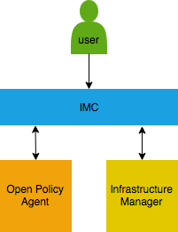
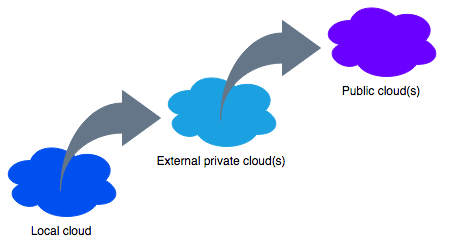

# IMC

## Overview

It is frequently assumed that when you're using a cloud you have access to an essentially infinite amount of resources, however this is not always the case. IMC is for situations when you have access to multiple small clouds and you need a tool which can deploy and configure virtual infrastructure on automatically-selected clouds, and also automatically handle deployment failures.

Features include:
* selection of clouds which meet specified requirements
  * e.g. I want to deploy a CentOS 7 VM with at least 8 cores and 32 GB of RAM
* clouds are ranked based on specified preferences
  * e.g. I would prefer my VMs to be deployed on my local private cloud, but if that is full try my national research cloud, but if that is also full then use a public cloud
* if deployment on a cloud fails, another cloud will be automatically tried, and the cloud which failed will temporarily be blacklisted
* VM flavour selection can be selected based on cost for the case of a public cloud
* clouds can be grouped into regions

IMC uses [Infrastructure Manager](https://github.com/grycap/im) to deploy and configure infrastructure on clouds, including OpenStack, AWS, Azure and Google Compute Platform. [Open Policy Agent](https://www.openpolicyagent.org) is used for making decisions about what cloud, VM flavour and image to use.

IMC allows for hierarchical cloud bursting. A simple example would be to burst from a single local private cloud to an external private cloud and then to burst from the external private cloud to a public cloud.

## Deployment

## Setup

## Usage

